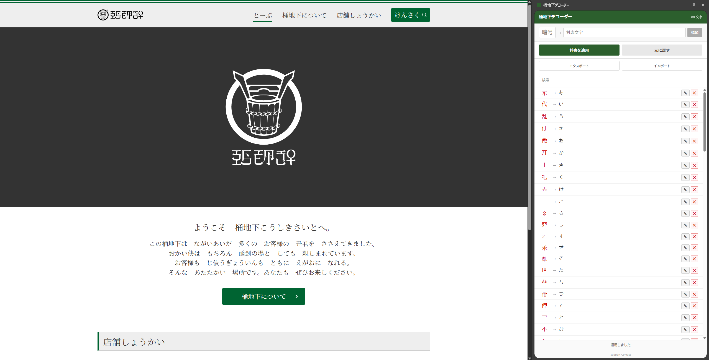

# 桶地下デコーダー

暗号文字を対応する文字に置換して表示する Chrome 拡張機能です。

## インストール

1. [Releases](https://github.com/3dy3day/okechika-decoder/releases) から `okechika-decoder.zip` をダウンロード
2. 解凍する
3. Chrome で `chrome://extensions` を開く
4. zipファイルをドラッグアンドドロップ

## 使い方

1. Chrome のツールバーにある拡張機能アイコンをクリック
2. サイドパネルが開き、暗号文字の辞書一覧が表示される
3. **辞書を適用** - 現在のページの暗号文字を対応する文字に置換
4. **元に戻す** - ページをリロードして元に戻す

## 機能

- 暗号 → 対応文字の辞書管理（追加・編集・削除）
- ページへの辞書適用・復元
- 辞書の検索
- 辞書のエクスポート / インポート（JSON）
- 漢字 → キー変換（逆引き）

## ライセンス

MIT
